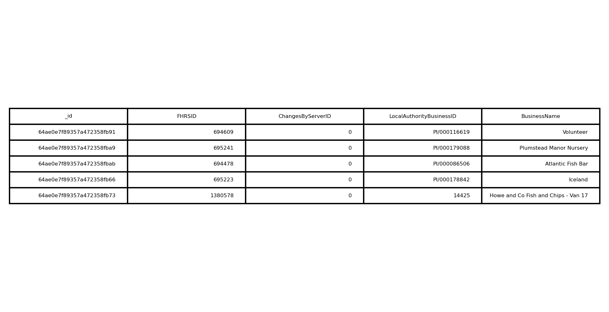
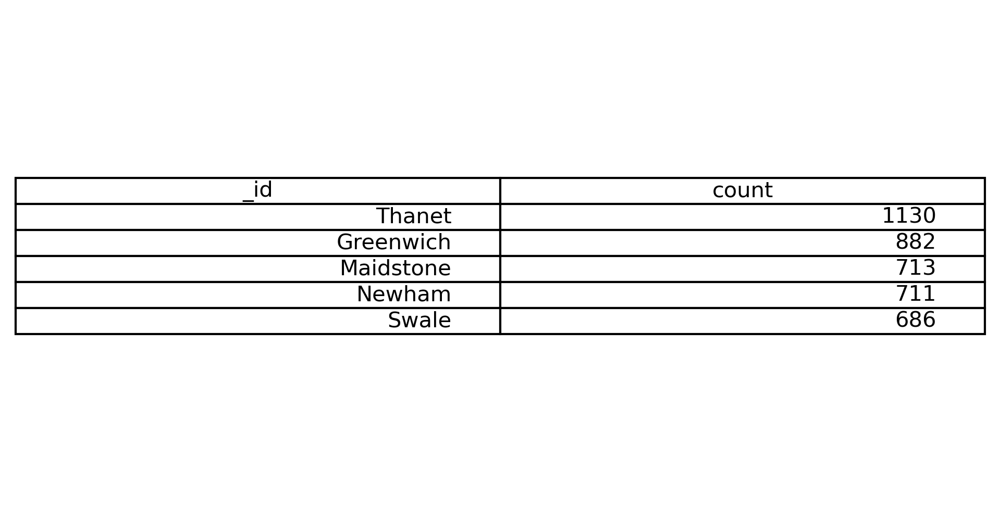

# Module 12: No SQL Challenge

<ins>Project Overview</ins>

This project focuses on using the UK Food Standards Agency's evaluations and ratings of different restaurants to help the editors *Eat Safe, Love* magazine decide where to focus their future articles. In completing this project, I referenced the class videos on MongoDB as well as the online documentation.

<ins>Process and Technologies</ins>

I started out by setting up a `uk_food` database using MongoDB, importing the data in the provided JSON file and creating an instance of MongoClient. Once I had the database and collections set up correctly, I made the necessary imports; MongoClient, pprint, pandas and matplotlib (so that I could make images of the DataFrames created in the analysis). The first step to this project found in the NoSQL_setup_starter file, was to update the database. I added in a new restaurant, Penang Flavors, updated all of their information, removed all the locations in Dover because the magazine was not interested in that location and converted the data types for several of the number values included in the dataset.

After this, I conducted an exploratory analysis based on some questions from the client that included:

* Which establishments have a hygiene score equal to 20?
* Which establishments in London have a RatingValue greater than or equal to 4?

* What are the top 5 establishments with a RatingValue of 5, sorted by lowest hygiene score, nearest to the new restaurant added, "Penang Flavours"?
* How many establishments in each Local Authority area have a hygiene score of 0? Sort the results from highest to lowest, and print out the top ten local authority areas.

For each of these questions, I used `count_documents` to display the number of documents in the result, `pprint` to display the first result and convert the result to a Pandas DataFrame to display the first 10 rows. After the analysis was finished, the magazine had a good list of places to visit and those to avoid.

<ins>Challenges</ins>

The biggest challenge that I faced with this project was converting the data types for the `RatingValue`, `longitude` and `latitude`. The first time that I tried it, I accidentally wrote over all of the values in that part of the data set instead of converting the type. After reviewing my code and watching the class videos, I realized my mistake was that I wasn't calling the correct part of the JSON file (i.e. 'latitude' instead of `geocode.latitude`. After deleting the database, correcting the code, recreating the database and reimporting the file, everything worked well.
